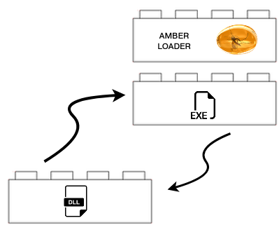

# Amber Loader v3.0

Amber Loader is a reflective PE loader designed for manually loading (mapping, relocating, and resolving) and executing PE files from memory. It is written fully in assembly using the NASM syntax. The loader supports both 32- and 64-bit PE files with TLS callbacks and forwarded imports.


<p align="center">
  
</p>

The lite version of the amber loader can be directly appended in front of a PE file for converting the file into a shellcode. 


- [amber_loader-x86-lite.bin](https://github.com/EgeBalci/amber/raw/master/loader/loader-x86/amber_loader-x86-lite.bin)
- [amber_loader-x64-lite.bin](https://github.com/EgeBalci/amber/raw/master/loader/loader-x64/amber_loader-x64-lite.bin)

### Example: Converting putty.exe into shellcode
```bash
wget https://github.com/EgeBalci/amber/raw/master/loader/loader-x64/amber_loader-x64-lite.bin -O shellcode
cat putty.exe >> shellcode && xxd -i shellcode
```
**(!! lite version do not wipe itself from the memory !!)**